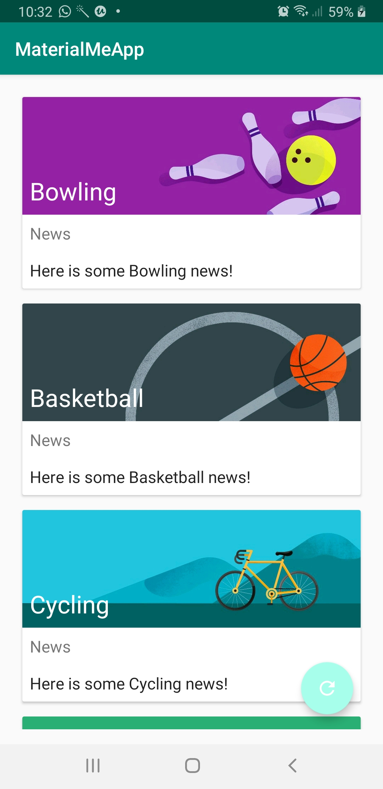

# MaterialdemoApp

This app Demonstrate the use of TypedArray to initialize image resources array.
ArrayList of Objects passed to adapter was made from array and array-string defined in string.xml

Used Card Layout and Floating Action Button 
Changed Colors of App using Color Pallete Primary,Accent and DarkPrimary according to guidelines

In RecyclerView -implemented action on swiping(deleting item from list) and moving(swaping items by dragging to particular position) using ItemTouchHelper class

The FAB which is refresh button in this case helps in restoring the list.

The challenge resolved was saving the state of arraylist(current List displayed), i.e arrayList of Objects, It was made possible with making the Object Parceable(implements Parceable) Parceable and saving onStateInstaceStae

   
    
    @Override
    protected void onSaveInstanceState(@NonNull Bundle outState) {
        super.onSaveInstanceState(outState);
        outState.putParcelableArrayList("sportsData", mSportsData);
        Log.e("TAG1", "onSaveInstanceState: "+mSportsData );
    }
    and retrieving in OnCreate and initializing recyclerView again
    
    // Get the data.
        if (savedInstanceState != null) {
            mSportsData = savedInstanceState.getParcelableArrayList("sportsData");
            Log.e("TAG1", "onCreate: "+mSportsData.toString() );
            mAdapter = new SportsAdapter(this, mSportsData);
            mRecyclerView.setAdapter(mAdapter);
        }else {
            initializeData();
        }
        
        
        
